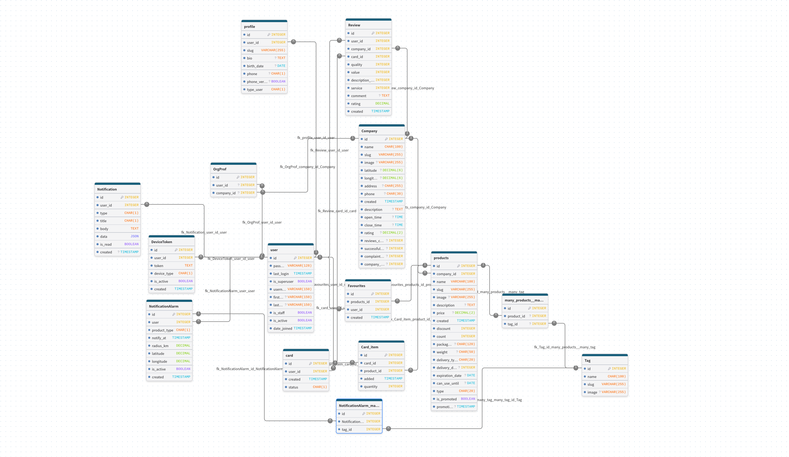

# AppSosa

Мобильное приложение для продажи и заказа еды.

https://github.com/user-attachments/assets/8f0e7b14-e346-432b-a37b-4a63c8b4df68

---
## Технологический стек

### Frontend

* Flutter
* Dart
* REST API
* JWT Authentication

### Backend

* Python
* Django
* Django REST Framework
* PostgreSQL
* JWT
* Djoser
* Celary
* Google_auth

---

# Backend

Backend реализован с использованием Django и Django REST Framework.

## Основные возможности

* Регистрация пользователей
* Авторизация пользователей
* JWT-аутентификация
* Управление профилем
* Каталог продуктов
* Категории продуктов
* Корзина
* Создание заказов
* История заказов
* Управление статусами заказов

## Установка

### Установка зависимостей

```bash
pip install -r requirements.txt
```

### Настройка переменных окружения

Создайте файл `.env`:

```env
GOOGLE_CLIENT_ID=
GOOGLE_CLIENT_SECRET=

EMAIL_HOST_USER=
EMAIL_HOST_PASSWORD=

DATABASES_NAME=
DATABASES_USER=
DATABASES_PASSWORD=
DATABASES_HOST=
DATABASES_PORT=
```

### Применение миграций

```bash
python manage.py migrate
```

### Создание суперпользователя

```bash
python manage.py createsuperuser
```

### Запуск сервера

```bash
python manage.py runserver
```

Backend будет доступен по адресу:

```text
http://127.0.0.1:8000
```

---

### Автоматическая документация 

Интерактивная документация API доступна по адресу:

- Swagger UI: `/api/docs`

# Frontend

Frontend реализован на Flutter.

## Установка

Перейдите в директорию приложения:

```bash
cd frontend
```

Установите зависимости:

```bash
flutter pub get
```

Запустите приложение:

```bash
flutter run
```

---

# Структура базы




## License

Проект является частным и предназначен для коммерческого использования.

© 2026 AppSosa
